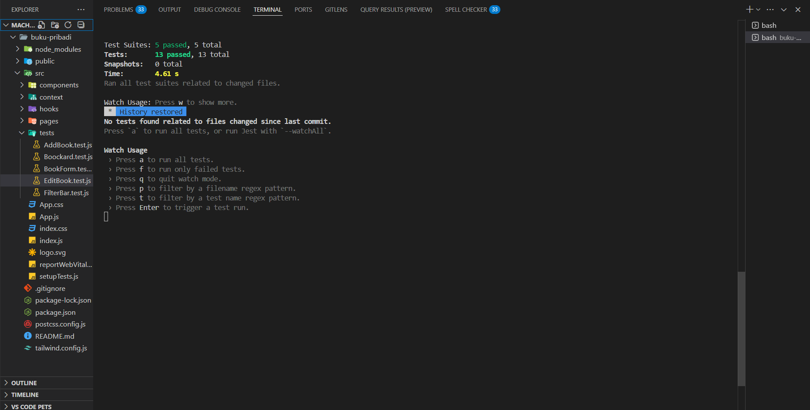
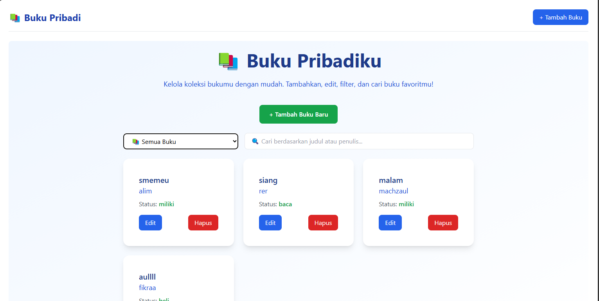
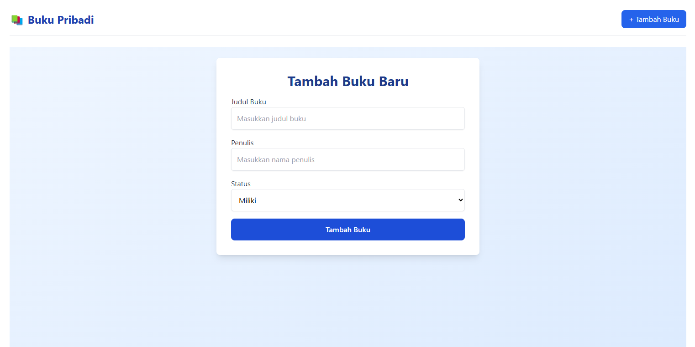
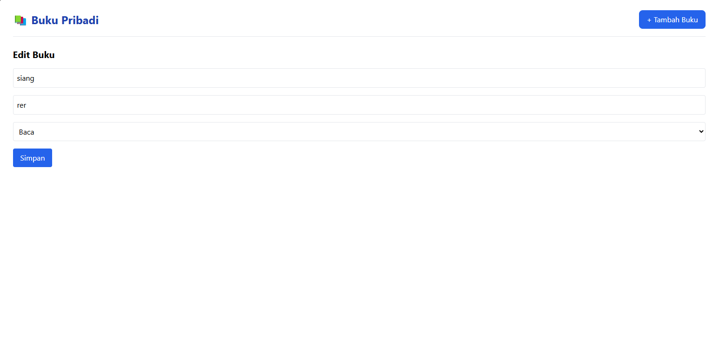

# 📚 Aplikasi Manajemen Buku Pribadi

Aplikasi ini dirancang untuk membantu pengguna mencatat dan mengelola buku-buku yang mereka **miliki**, **sedang dibaca**, atau **ingin dibeli**. Dengan antarmuka sederhana dan fitur lengkap, aplikasi ini memungkinkan pencatatan, penyaringan, serta pencarian buku secara mudah.

---

## ✨ Fitur Utama

✅ Menambah buku baru dengan detail:
- Judul
- Penulis
- Status: *Dimiliki*, *Sedang Dibaca*, atau *Ingin Dibeli*

✅ Mengedit dan menghapus buku  
✅ Filter buku berdasarkan status  
✅ Pencarian buku berdasarkan judul atau penulis  
✅ Penyimpanan data di `localStorage`  
✅ Antarmuka yang responsif dan user-friendly  

---

## ⚙️ Teknologi yang Digunakan

| Teknologi              | Penggunaan                                               |
|------------------------|----------------------------------------------------------|
| React                  | Library utama untuk membangun UI                        |
| React Router           | Navigasi antar halaman                                   |
| Context API            | Manajemen state global                                   |
| useState, useEffect    | Pengelolaan state dan efek samping                      |
| Custom Hooks           | Dua hook khusus untuk filtering dan localStorage         |
| PropTypes              | Validasi tipe props untuk komponen                       |
| localStorage           | Penyimpanan data buku                                    |
| React Testing Library  | Pengujian unit test                                      |
| Vite                   | Build tool ringan dan cepat                              |

---

## 💡 Komponen Reusable

1. **`BookForm`**: Formulir yang digunakan untuk menambahkan dan mengedit buku  
2. **`BookItem`**: Menampilkan satu entri buku  
3. **`BookList`**: Menampilkan daftar buku dengan filter dan pencarian

---

## 🛠️ Custom Hooks

- **`useLocalStorage(key, defaultValue)`**  
  Untuk menyimpan dan mengambil data dari `localStorage`

- **`useFilterBooks(books, status, searchTerm)`**  
  Untuk memfilter dan mencari buku berdasarkan status dan kata kunci

---

## 🧪 Pengujian (Unit Test)

Dilakukan dengan **React Testing Library** dan **Vitest**.  
✅ Total: 5 unit test  
🧪 Pengujian meliputi:
- Rendering form
- Validasi input
- Tambah buku
- Edit buku
- Filter buku

📷 Screenshot hasil test:
  


---

## 💥 Error Handling

- Validasi form untuk memastikan semua input terisi
- Validasi status hanya bisa dipilih dari pilihan yang tersedia
- Notifikasi jika buku tidak ditemukan saat edit
- Notifikasi jika pencarian tidak ditemukan

---

## 🖼️ Screenshot Antarmuka

### ✅ Halaman Utama
Menampilkan semua buku + filter & pencarian  


### ➕ Tambah Buku


### 📝 Edit Buku


---

## 🚀 Instalasi & Menjalankan

### 1. Clone Repository
```bash
git clone https://github.com/username/Pemrograman_web_itera_122140172.git
cd Machzaul_122140172_pertemuan3
cd buku-pribadi

npm install
npm run dev

##  Test nya 
npm run test
